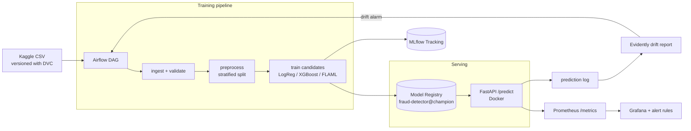

# System architecture

```mermaid
flowchart LR
  A[Kaggle CSV<br/>versioned with DVC] --> B[Airflow DAG]
  subgraph Training pipeline
    B --> C[ingest + validate] --> D[preprocess<br/>stratified split] --> E[train candidates<br/>LogReg / XGBoost / FLAML]
  end
  E --> F[(MLflow Tracking)]
  E --> G[(Model Registry<br/>fraud-detector@champion)]
  subgraph Serving
    G --> H[FastAPI /predict<br/>Docker]
  end
  H --> I[prediction log]
  H --> J[Prometheus /metrics]
  I --> K[Evidently drift report]
  J --> L[Grafana + alert rules]
  K -- drift alarm --> B
```

TODO(team): export this as a PNG for the slides.
